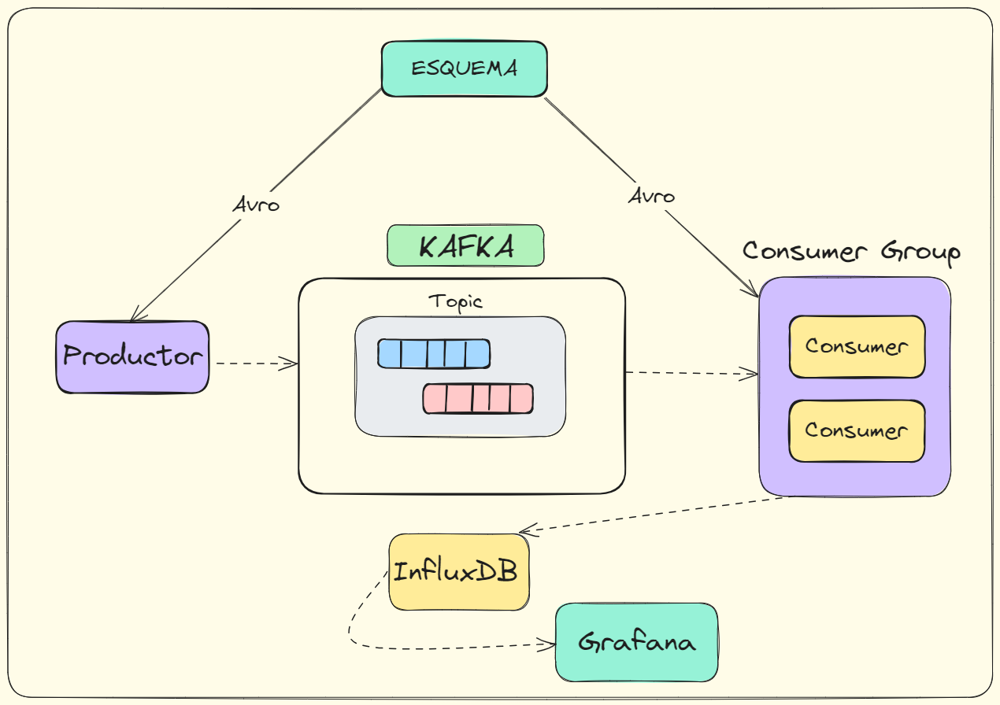

# Indice
- [Indice](#indice)
- [Introducción](#introducción)
- [Instalación y prueba](#instalación-y-prueba)
    - [Requerimientos](#requerimientos)
    - [Setup paso a paso](#setup-paso-a-paso)
- [Esquema general del proyecto](#esquema-general-del-proyecto)
    - [Estructura del proyecto](#estructura-del-proyecto)
- [Productor](#productor)
    - [ISR](#réplicas-síncronas-isr)
    - [Parámetro acks](#parámetro-acks)
    - [Ejemplo del key-hash](#ejemplo-del-key-hash)
- [Consumidores](#consumidores)
    - [Estrategias de consumo](#estrategias-de-consumo)
- [Docker y Kafka](#docker-y-kafka)
  - [Kafka-server / Broker](#kafka-server--broker)
  - [Kafka-UI](#kafka-ui)
  - [Schema-registry](#schema-registry)
- [InfluxDB](#influx)
- [Grafana](#visualización)


# Introducción

* [URL pública de Grafana](https://mesekav225.grafana.net/public-dashboards/6cc9bbf2b39e48b3965aa73c4a4d91a5)

Este proyecto busca poner en práctica lo aprendido con ``KAFKA``. Consiste en una representación en tiempo real de un gráfico de velas japonesas sobre las criptomonedas más populares. 

El proyecto se apoya en un archivo ``DOCKER`` que contiene todos los servicios necesarios, ``InfluxDB`` para las series temporales y ``Grafana`` para la visualización y creación del gráfico.

# Instalación y prueba

### Requerimientos
- Tener instalado python3.
- Tener instalado docker.
- Abrir y configurar una cuenta cloud en InfluxDB y Grafana.
- Configurar los parámetros en el archivo env.

*Algunas versiones recientes de Python pueden dar problemas con la librería de Kafka. Si ocurre, recomiendo utilizar una versión de Python inferior.*

### Setup paso a paso

1. Creación del entorno python
  
  ```py
    python -m venv kafka-venv
  ```

2. Instalación de las dependencias
  ```py
    cd config
    pip install -r librerias.txt
  ```

3. Lanzar docker
```py
  cd ..
  docker-compose up -d
```
4. Lanzar el script ``launch.sh``
```py
  ./launch.sh
```

*Si no tiene permisos lanzar en la misma consola bash de VScode:*

```py
  chmod +x launch.sh
```

 # Esquema general del proyecto




### Estructura del proyecto

| **Nº** | **Componente** | **Descripción** |
| --- | --- | --- |
| 1 | Productor | Nuestro generador de datos |
| 2  |Consumidores | Nuestros clientes |

| | |
| --- | --- |
| 1 |**Tópico** | Estructura de datos que almacena los mensajes |
| 2 |Particiones | Estructura de datos que almacena los mensajes |
| 3 |Réplicas | Estructura de datos que almacena los mensajes |
| 2 |ISR | Estructura de datos que almacena los mensajes |


Tenemos un **productor** que, en este caso, obtiene datos de una API de criptomonedas y envía los mensajes al Topic creado mediante el método de ``key-hash`` asegurando que cada mensaje vaya a una determinada partición.

**El mensaje** se serializa y se transmite a Kafka siguiendo el esquema Avro. Entonces, mediante el parámetro ``acks=all`` el productor espera la confirmación de que los datos se han recibido y copiado en el líder y réplicas síncronas (ISR).

Después, **los consumidores** consumen el mensaje deserializando el contenido mediante el mismo esquema. 

# Productor


#### Réplicas síncronas (ISR)

Por defecto, las réplicas seguidoras (no líder) copian la información de forma asíncrona. Kafka permite modificar ese comportamiento y definir réplicas síncronas.

Esto permite una mayor tolerancia a fallos y asegura la disponibilidad de los datos. Por ejemplo:

Si sólo hay una copia síncrona y esta muere, puede haber pérdida de datos. Si existen más de una, es casi imposible perder información.

#### Parámetro 'acks'
Además de establecer el ``min.insync`` (ISR) también hay que configurar el envio de mensajes que hace el productor, en este caso, habria que establecer el parámetro ``acks=all``. 

``ACKS`` tiene 3 variantes:
 - 0 = Sin comprobación de que el mensaje se ha escrito correctamente.
 - 1 = El mensaje ha llegado con éxito al líder.
 - all = Se ha completo con éxito en todas las replicas ISR + líder.

### A la hora de definir como envía el mensaje el Productor con send():


 - Puedes especificar que sea por ``Round-Robin`` para que los mensajes se repartan entre las particiones existentes de forma equitativa.
 - Puedes especificar una ``particion de forma explicita``. Por ejemplo: "Productor 1 que envie al topic A - particion 0"
 - Por ``key-hash``. Se utiliza para distribuir los mensajes de forma equitativa entre las diferentes particiones y al mismo tiempo garantiza que todos los mensajes con la misma clave sean enviados a la misma partición. 
 
 
#### Ejemplo del key-hash

```python
  producer.produce('mi_topic', key='Panes', value='Pan de almendras y nueces', callback=delivery)
  producer.produce('mi_topic', key='Bollos', value='Cupcake de fresa', callback=delivery)
  producer.produce('mi_topic', key='Bollos', value='Berlina de chocolate', callback=delivery)
  producer.produce('mi_topic', key='Panes', value='Pan de semillas', callback=delivery)
```

**Si tenemos 2 particiones**:
 - Particion 0 => Todos los mensajes con la clave 'Bollos'.
 - Particion 1 => Todos los mensajes con la clave 'Panes'.

**Como funciona el key-hash internamente:**

Kafka toma la clave del mensaje, calcula su hash y luego aplica una operación de módulo con el número de particiones del topic:
- ``hash(key) % num_partitions`` 
   
El resultado es el índice de la partición a la que se enviará el mensaje.


# Consumidores

 Un grupo de consumidores permite procesar los mensajes en conjunto de una o varias particiones de un topico. Los consumidores de un mismo grupo no pueden pisarse entre ellos, de forma que *se puede establecer diferentes estrategias de consumo*:
 - RangeAssignor (por defecto)
 - Round Robin
 - StickyAssignor


* El ``group_id`` permite definir el grupo de consumidores.
* El ``client_id`` define un nombre único a cada consumidor.

El parámetro ``earliest`` permite a un consumidor volver a **leer desde el principio** todos los mensajes, mientras que ``latest`` forzaría a los consumidores a leer desde el último mensaje disponible.

### Estrategias de consumo

Como se ha mencionado antes, Kafka incluye varias estrategias y también te permite crear algoritmos personalizados:
 - RangeAssignor (por defecto)
 - Round Robin
 - StickyAssignor

 #### RangeAssignor

 Cuando hay múltiples tópicos y consumidores, agrupa las diferentes particiones por su member-id. De modo que el ``consumidor[0]`` se ocuparía de todas las ``particiones[0]``, mientras que el ``consumidor[1]`` lo haria de las ``particiones[1]`` independientemente del tópico.


#### RoundRobinAssignor

Distribuye las particiones de forma equitativa entre los diferentes consumidores **ignorando la partición** de la cual provengan. Esta estrategia, aunque útil, puede presentar problemas a la hora de la reasignación cuando uno de los consumidores pase a no disponible.


#### StickyAssignor

Se comporta de forma similar al Round Robin, pero intenta minimizar el movimiento (asignación de consumo) entre las diferentes particiones. Usando el ejemplo anterior, si el consumidor C2 muere o abandona el grupo, entonces solo se produce una reasignación de las particiones que consumía el C2 => C3.


 * [Mas info](https://medium.com/streamthoughts/understanding-kafka-partition-assignment-strategies-and-how-to-write-your-own-custom-assignor-ebeda1fc06f3)

# Docker y Kafka

A continuación se van a explicar los servicios más importantes y su configuración.

## Kafka-server / Broker

#### ¿Qué es un Broker?
Un broker en Kafka es una estructura lógica que almacena información. Gestiona el almacenamiento y la réplica de los datos.

#### Configuración
Dentro de kafka, existe un archivo llamado ``config.properties`` que permite modificar la configuración del servidor. En el caso de ``DOCKER`` cada parámetro se representa con las variables de entorno, siguiendo la siguiente nomenclatura:
- ``MI_PARAMETRO_KAFKA:10`` en lugar de ``mi.parametro.kafka=10``.

***Disclaimer:** puede diferir según la imagen docker que se utilice*

#### Ejemplo en Docker

```yml
# ::::: KAFKA BROKER ::::::::::::
  broker_1:
    image: confluentinc/cp-kafka:latest
    hostname: broker_1
    container_name: broker_1
    depends_on:
      - zookeeper
    ports:
      - "9090:9090"
      - "19090:19090"
      - "29090:29090"
    networks:
      - kafka_net
    environment:
      KAFKA_BROKER_ID: 1
      KAFKA_ZOOKEEPER_CONNECT: 'zookeeper:2181'
      KAFKA_INTER_BROKER_LISTENER_NAME: RED_INTERNA
      KAFKA_LISTENER_SECURITY_PROTOCOL_MAP: RED_INTERNA:PLAINTEXT,RED_EXTERNA:PLAINTEXT,RED_LOCAL:PLAINTEXT #plaintext = sin cifrado
      KAFKA_ADVERTISED_LISTENERS: 
        RED_EXTERNA://kafka-azure.norwayeast.cloudapp.azure.com:9090,
        RED_INTERNA://broker_1:29090,
        RED_LOCAL://localhost:19090
      KAFKA_LISTENERS: 
        RED_EXTERNA://:9090, 
        RED_INTERNA://broker_1:29090, 
        RED_LOCAL://broker_1:19090
      KAFKA_NUM_PARTITIONS: 2
      KAFKA_DEFAULT_REPLICATION_FACTOR: 3
      KAFKA_MIN_INSYNC_REPLICAS: 2
      KAFKA_LOG_DIRS: /var/lib/kafka/data
    restart: always
```

#### Red de Kafka

Se definen 3 tipos de redes para el servidor:
- ``RED_INTERNA:`` permite la comunicación interna entre los diferentes contenedores (brokers, zookeper) mediante el nombre de su ``host`` y el parámetro de red ``network`` de Docker.
- ``RED_LOCAL``: permite la comunicación del localhost (tu máquina) con los contenedores de Docker.
- ``RED_EXTERNA``: permite exponer los servidores a los servicios externos (Cloud Grafana, Databricks...).

*También es posible definir si la información viaja cifrada o en texto plano (``PLAINTEXT``)*

## Kafka-UI

Este servicio permite visualizar de forma gráfica todo lo que hace Kafka tras las bambalinas. Proporciona:
- Número de topics, particiones, réplicas
- Número de mensajes, offsets y su contenido/valor
- Seguimiento de los consumidores, su nº, grupo, ID...
- Recepción en vivo de los mensajes, nº de mensajes consumidos etc...


## Schema-registry

#### ¿Qué es un esquema de registro?
 El Schema Registry de Kafka es un servicio que almacena y gestiona los esquemas de datos utilizados para la serialización y deserialización de los mensajes.

#### Ventajas

El servicio centraliza y registra los esquemas de datos para asegurar la compatibilidad entre productores y consumidores. 

- Proporciona validación de esquemas para garantizar que los mensajes sean compatibles con los esquemas esperados por los consumidores.
- Permite la evolución controlada de los esquemas, facilitando cambios y actualizaciones sin interrupciones en la comunicación entre aplicaciones.

#### Funcionamiento

Dentro del proyecto, utilizamos el script ``avro_schema.sh`` en ``launch.sh`` para crear el esquema de datos de forma automática.


# Influx

#### ¿Qué es InfluxDB?

InfluxDB es una base de datos orientada a series temporales que combina campos indexados (fields) y no indexados (tags) permitiendo realizar consultas muy rápidas sobre nuestros datos. Los datos se organizan en medidas (measurements), series, y puntos, donde cada punto tiene un timestamp.

### Uso

Se ha utilizado la siguiente consulta para que el gráfico de vela pudiera consumir correctamente los datos de nuestra API.

```sql
SELECT
  DATE_BIN(INTERVAL '2 minutes', time, '1970-01-01T00:00:00Z'::TIMESTAMP) AS _time,
  first_value(close_price ORDER BY time) AS Open,
  MAX(close_price) AS High,
  MIN(close_price) AS Low,
  last_value(close_price ORDER BY time) AS Close
FROM "criptomonedas666"
WHERE "Coin" IN ('tBTCUSD')
GROUP BY _time
ORDER BY _time
```

* ``DATE_BIN()::TIMESTAMP::`` Crea un intervalo de tiempo y lo formatea a TIMESTAMP.
* ``first_value("close_price"):`` Selecciona el primer precio de cierre en el intervalo.
* ``last_value("close_price"):`` Selecciona el último precio de cierre en el intervalo.
* ``MAX("close_price"):`` Selecciona el precio más alto de la moneda dentro en el intervalo.
* ``MIN("close_price"):`` Selecciona el precio más bajo de la moneda dentro en el intervalo.


# Visualización

### ¿Qué es Grafana?

``Grafana`` es una plataforma interactiva y dinámica de código abierto. Permite almacenar, visualizar, analizar y comprender métricas de rendimiento/datos de una forma clara y sencilla. 

### Gráficos


